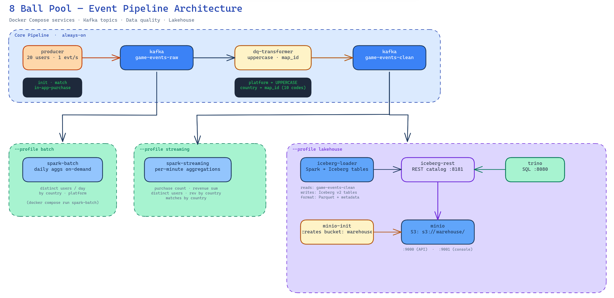
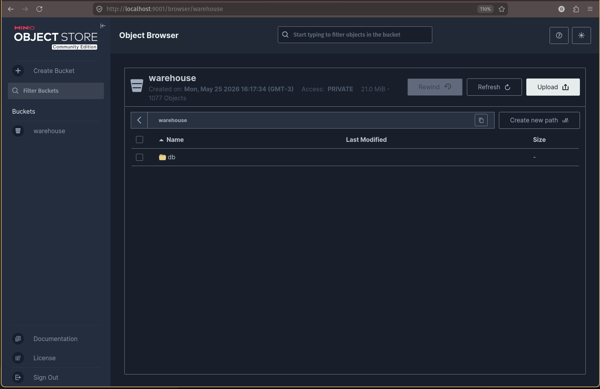
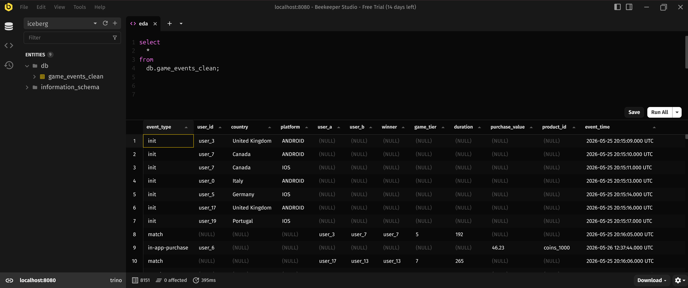
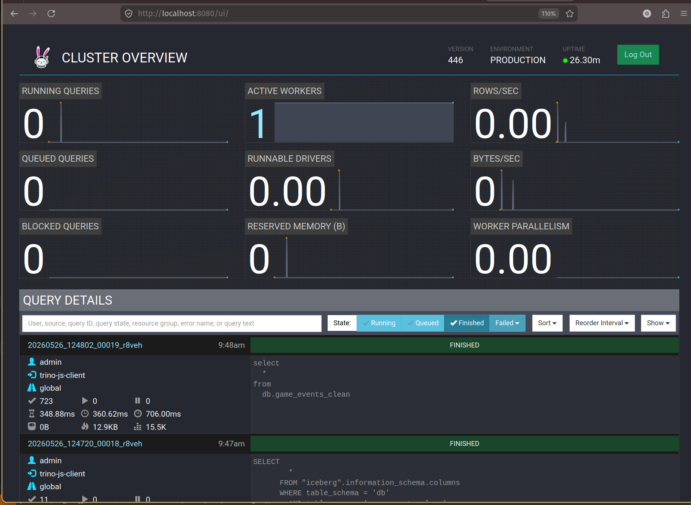

# miniclip-data-engineering-assignment

Real-time event processing pipeline for 8ballpool game events. Built with Kafka, PySpark, and Python.

## Architecture



The pipeline is fully containerised via Docker Compose and organised into three composable profiles:

**Core (always-on)** — a synthetic `producer` generates `init`, `match`, and `in-app-purchase` events at a configurable rate and publishes them to the `game-events-raw` Kafka topic. A `dq-transformer` consumes that topic, applies a YAML-configured set of field transformations (e.g. uppercasing `platform`, mapping `country` codes to full names), and re-publishes the cleaned events to `game-events-clean`.

**`--profile batch`** — `spark-batch` is an on-demand Spark job that reads from `game-events-clean` and prints daily distinct-user counts grouped by country and platform.

**`--profile streaming`** — `spark-streaming` reads continuously from `game-events-clean` and emits per-minute aggregations: purchase count, total revenue, distinct active users, revenue by country, and match count by country.

**`--profile lakehouse`** — `iceberg-loader` streams events from `game-events-clean` into a partitioned Iceberg v2 table stored as Parquet on MinIO (S3-compatible). `iceberg-rest` serves the Iceberg REST catalog backed by the same MinIO bucket. `trino` connects to the catalog and exposes the tables for interactive SQL queries.

## Prerequisites

- [Docker](https://docs.docker.com/get-docker/) and Docker Compose
- [uv](https://docs.astral.sh/uv/getting-started/installation/) (for running tests locally)

## Running the pipeline

### 1. Start Kafka and the producer

```bash
docker compose up -d kafka producer
```

Kafka runs in KRaft mode (no Zookeeper). The producer publishes one event per second to `game-events-raw`. Watch it in real time:

```bash
docker compose logs -f producer
```

To inspect the raw messages arriving in Kafka:

```bash
docker compose exec kafka /opt/kafka/bin/kafka-console-consumer.sh \
  --bootstrap-server localhost:9092 \
  --topic game-events-raw --from-beginning
```

To list all topics:

```bash
docker compose exec kafka /opt/kafka/bin/kafka-topics.sh \
  --bootstrap-server localhost:9092 \
  --list
```

To check topic metadata (partitions, replication, offsets):

```bash
docker compose exec kafka /opt/kafka/bin/kafka-topics.sh \
  --bootstrap-server localhost:9092 \
  --describe \
  --topic game-events-raw
```

To check how many messages have been written to the topic:

```bash
docker compose exec kafka /opt/kafka/bin/kafka-get-offsets.sh \
  --bootstrap-server localhost:9092 \
  --topic game-events-raw
```

Output format is `topic:partition:offset` — e.g. `game-events-raw:0:143` means 143 messages in partition 0.

### 2. Start the DQ transformer

The transformer reads from `game-events-raw`, applies transformations, and publishes to `game-events-clean`:

```bash
docker compose up -d dq-transformer
```

Watch the transformations in real time:

```bash
docker compose logs -f dq-transformer
```

You should see `init` events with `platform` uppercased and `country` expanded to a full name:

```
→ init  user=user_4  platform=IOS  country=Portugal
→ init  user=user_7  platform=ANDROID  country=Brazil
→ match  user=user_2  platform=-  country=-
```

To inspect the cleaned messages in Kafka:

```bash
docker compose exec kafka /opt/kafka/bin/kafka-console-consumer.sh \
  --bootstrap-server localhost:9092 \
  --topic game-events-clean --from-beginning
```

#### Adding a new transformation rule

Transformations are configured in `dq_transformer/config/rules.yaml` — no code changes required. Each rule entry specifies a `type`, a `field`, and which `event_types` it applies to:

```yaml
rules:
  - type: uppercase
    field: platform
    event_types: [init]

  - type: map_id
    field: country
    event_types: [init]
    mapping:
      PT: Portugal
      US: United States
```

Supported rule types:


| Type        | Effect                                    | Example         |
| ----------- | ----------------------------------------- | --------------- |
| `uppercase` | Uppercases the field value                | `ios → IOS`     |
| `map_id`    | Maps a value to a name via a lookup table | `PT → Portugal` |


### 3. Run the Spark batch aggregation

Let the producer run for at least 30 seconds to accumulate data, then:

```bash
docker compose --profile batch run --rm spark-batch
```

This reads all messages in `game-events-raw` from the beginning and prints daily distinct user counts by country and platform:

```
+----------+-------+--------+--------------+
|date      |country|platform|distinct_users|
+----------+-------+--------+--------------+
|2024-01-15|BR     |ios     |2             |
|2024-01-15|PT     |android |3             |
+----------+-------+--------+--------------+
```

### 4. Run the Spark Streaming aggregation

The streaming job reads from `game-events-clean` and prints five per-minute aggregations every 60 seconds:

- Count of all purchases
- Sum of all revenue
- Number of distinct active users
- Revenue by country
- Number of matches by country

Start it with:

```bash
docker compose --profile streaming up spark-streaming
```

Country is derived from `init` events and accumulated in-memory across micro-batches. Users whose `init` event has not yet been seen are grouped under `"Unknown"` until the event arrives.

Sample output (printed every minute):

```
============================================================
  Batch 1 — per-minute aggregations
============================================================

>> Global metrics (purchases / revenue / distinct users):
+--------------+------------------+---------------+
|purchase_count|total_revenue     |distinct_users |
+--------------+------------------+---------------+
|3             |47.97             |12             |
+--------------+------------------+---------------+

>> Revenue by country:
+-------------+------------------+
|country      |revenue           |
+-------------+------------------+
|Brazil       |9.99              |
|Portugal     |37.98             |
+-------------+------------------+

>> Matches by country:
+-------------+-----------+
|country      |match_count|
+-------------+-----------+
|Brazil       |4          |
|Portugal     |7          |
+-------------+-----------+
```

The job checkpoints Kafka offsets to a named Docker volume (`streaming_checkpoint`) so it resumes from where it left off on restart.

### 5. Run the lakehouse stack (MinIO + Iceberg + Trino)

The lakehouse profile adds durable storage and interactive SQL on top of the existing pipeline.

Start the full stack:

```bash
docker compose up -d kafka producer dq-transformer
docker compose --profile lakehouse up -d
```

This brings up five additional services:


| Service          | Purpose                          | Port                       |
| ---------------- | -------------------------------- | -------------------------- |
| `minio`          | S3-compatible object store       | 9000 (API), 9001 (console) |
| `minio-init`     | One-shot bucket creation         | —                          |
| `iceberg-rest`   | Iceberg REST catalog             | 8181                       |
| `iceberg-loader` | Spark Streaming → Iceberg writer | —                          |
| `trino`          | SQL query engine                 | 8080                       |


The `iceberg-loader` reads from `game-events-clean`, normalises column names, converts the unix timestamp to a proper `TIMESTAMP`, and writes to the `iceberg.db.game_events_clean` table partitioned by `event_type` and day. The first batch commits within 30 seconds of startup.

#### Verifying data is flowing

Check the MinIO console at `http://localhost:9001` (credentials: `minioadmin` / `minioadmin`). Parquet files should appear under `warehouse/db/game_events_clean/` within the first minute.

Check the Iceberg catalog:

```bash
curl http://localhost:8181/v1/namespaces/db/tables
```

#### Querying with Trino

```bash
docker compose exec trino trino
```

```sql
-- Confirm the table is visible
SHOW TABLES FROM iceberg.db;

-- Row count (grows every 30 s)
SELECT COUNT(*) FROM iceberg.db.game_events_clean;

-- Event distribution
SELECT event_type, COUNT(*) AS events
FROM iceberg.db.game_events_clean
GROUP BY event_type;

-- Revenue by country
SELECT country, ROUND(SUM(purchase_value), 2) AS revenue
FROM iceberg.db.game_events_clean
WHERE event_type = 'in-app-purchase'
GROUP BY country
ORDER BY revenue DESC;

-- Matches by country
SELECT country, COUNT(*) AS match_count
FROM iceberg.db.game_events_clean
WHERE event_type = 'match'
GROUP BY country
ORDER BY match_count DESC;
```

You can also access the Iceberg Catalog using a SQL Client like DBeaver or Beekeeper over the `localhost:8080` for a more fluid experience querying the Iceberg tables.


#### Monitoring queries with the Trino UI

Trino exposes a web UI at `http://localhost:8080`. It shows running and completed queries, cluster stats, and worker node status — no login required.


### 6. Tear down

```bash
docker compose down
```

## Running the tests

Tests run locally without Docker. `[uv](https://docs.astral.sh/uv/)` manages the virtualenvs automatically — no manual activation needed.

```bash
# Event generator tests — validates generated events against the JSON schemas in schemas/
cd producer
uv run pytest tests/ -v

# Spark aggregation tests (batch + streaming) — pure DataFrame logic, no Kafka or Docker required
cd spark
uv run pytest tests/ -v

# DQ transformer rule tests — pure rule logic, no Kafka or Docker required
cd dq_transformer
uv run pytest tests/ -v
```

`uv run` creates the virtualenv on first run and reuses it on subsequent runs. Python 3.11 is pinned via `.python-version` in each service directory.